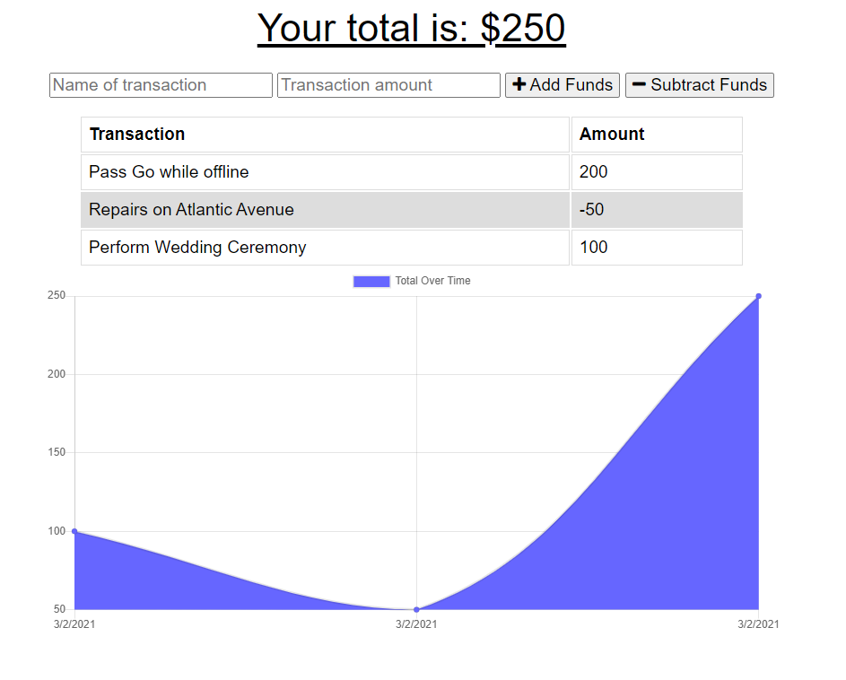

# Budget Tracker

## Description

Budget Tracker is a web-based platform for tracking expense and income data.  This is a full-stack app that demonstrates create/read functionality utilizing Mongoose/MongoDB.  The app has a service-worker and webmanifest and stores user inputs in IndexedDB for later submission to the remote database.

## Table of Contents

* [Features](#Features)
* [Links](#Links)
* [Screenshots](#Screenshots)
* [Technology](#Technology)
* [Notes](#Notes)
* [Contributors](#Contributors)
* [License](#License)

## Features
Main Features: 

* Users can:
    * [x] Log new transactions (name and amount)
    * [x] View past transactions
    * [x] View a graph of the current balance over time

## Links

* Project Repo: [Repository](https://github.com/danaument/budget-tracker)
* Deployed Application: [Budget Tracker](https://budget-tracker-a-la-pwa.herokuapp.com/)

## Screenshots

## Technology

| Language | Dependencies |  |
| --- | --- | --- |
| Javascript | mongoose | chart.js |
| HTML | indexeddb | heroku |
| CSS | express | mongodb atlas |

## Contributors
Dan Aument

The front-end components of this project were provided by The Coding Boot Camp at UT Austin in partnership with Trilogy Education Services.

## Notes

This project was my first foray into making a progressive web app - or at least to provide some persistent utility with an intermittent internet connection.

## License

MIT © 2021 Dan Aument